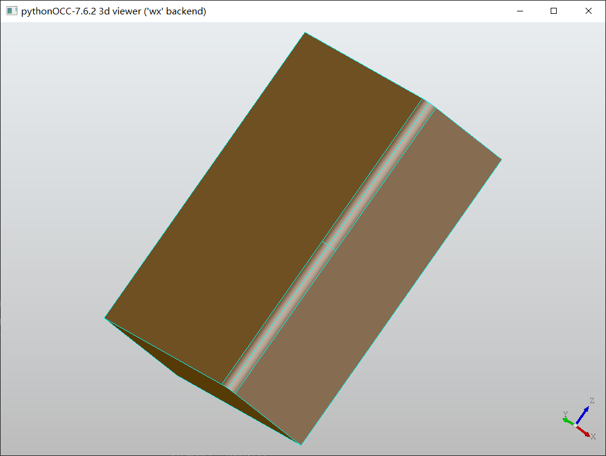
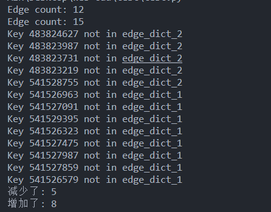
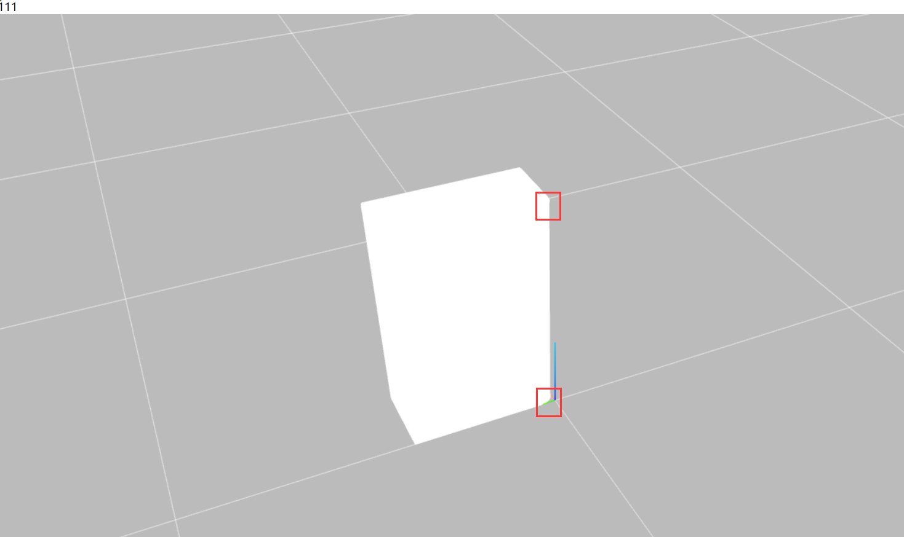
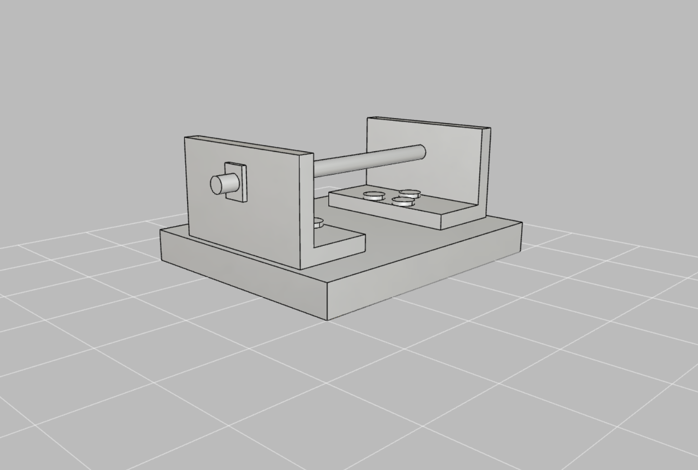
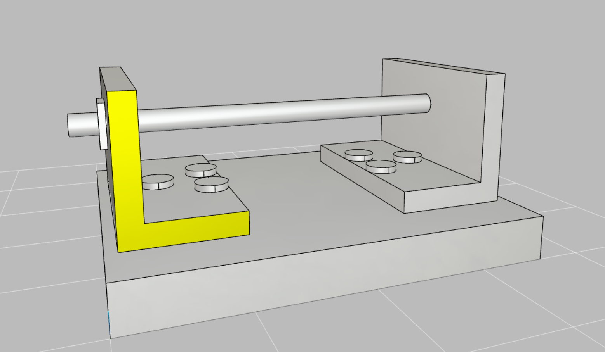

# 开发日志

## 23-11-30

从今天开始正式进入毕设的开发周期。

### 前端 CAD 技术栈选择？

查看了之前抱有很大希望的 `jsketcher` 项目，虽然这个项目确实和我的毕设成品很像，并且功能完善，但是里面运用的大量未知技术 + 缺乏技术文档还是把我劝退了。里面的内容很复杂，以我目前的水平，在正常时间内没有成功剖析这个项目的可能性。因此必须要另寻出路。

而且以目前的情报来看，似乎这个 `jsketcher` 的 CAD 引擎是自研的，只对有一个类型文件告诉了外界有哪些 API，而且基本在网上找不到相关的教程，这意味着整体是一个黑盒。但是如果一定要用，参考 `jsketcher` 的实现，不一定不能用。

另一种可能性是使用 `opencascade.js`，这个库本身是对于 opencascade 的 webassambly 化，基本上也看不到任何教程，看起来想要学会使用这个玩意儿，必须要学会 opencascade 本身，而且里面的函数命名也非常的恶心。

还有一种可能性是使用更好的封装版本，目前看起来 [jscad/OpenJSCAD.org](https://github.com/jscad/OpenJSCAD.org) 像是比较可行的一种方案。需要继续研究一下。


## 23-12-1

### CAD 操作全位于服务端的可能性

感觉可以考虑一种做法，就是将所有对于模型的操作都放到后台来进行。这样就有一个好处，前端只需要展示模型和负责传输数据即可。而且在本来的计划里面，复杂的操作就是要放到后端服务器来做的。

好处：

- 减小开发量：前端不再需要使用陌生的技术栈写一遍 CAD 操作（目前的瓶颈），只需要做数据传输和展示即可
- 结构更加统一：所有的 CAD 操作都在后端服务器上完成，项目更容易维护
- 对客户机的压力减小：网页加载加速、客户机可能本身就承担不了 CAD 操作的运算量

坏处：

- 对于简单模型的简单操作，向用户的展示速度会变慢（本来在客户端就快速进行的操作，现在需要在服务端做完之后再将模型数据回传，然后客户端还要重新载入模型）
- 对于服务器的压力陡增，当多人同时使用的时候，数据传输量和服务器压力非常大（因为要在服务器上进行 CAD 操作）

需要根据项目本身的性质来做决定：

- 项目的主要目的是提供线上的模型编辑还是提供线上的模型查看交流？
  - 讨论结果：模型的编辑

- 项目会有大量且频繁的 CAD 操作吗？一次 CAD 操作的平均时间是多少？网络传输模型 + 模型重新加载 所消耗的时间对于用户是否可以接受？
  - 讨论结果：由于我们最后做的是一个增量式的更新，因此网络传输之类的就不再是大的问题（希望如此）。我们的 CAD 操作大部分都比较简单，当我们的零件树足够成熟之后，可以看做是对零件树上的某一个零件进行小操作，具体可能就是将一个小立方体放大缩小之类的。


### 对 jscad 的研究

看起来 jscad 不是很适合我们这个项目，他使用的底层引擎不是 opencascade，因此很多需要的功能都缺失了。目前看起来 jscad 的功能只有：

- 新建简单的三维图形，并对图形进行渲染
- 对图形做一些简单的操作
- js 实时代码编程
- 读取一些文件

但是如果考虑到我们把所有的 CAD 操作全部放置于后端，前端只需要做一个展示的话，jscad 可能可以作为基底存在，但是还存在一些问题：

- 零件树应该如何制作？
- 零件标注怎么做？（说实话，标注又是什么？需要询问一下）
  - 讨论结果：标注就是给某一个 face、edge、point、part 上一个信息标注，可以添加自定义注释信息，可以和零件树结合。


## 23-12-2

### BREP 文件剖析

[STEP与BRep_飞翼剑仆的博客-CSDN博客](https://blog.csdn.net/Zhanglin_Wu/article/details/129972239)

[BRep Format - Open CASCADE Technology Documentation](https://dev.opencascade.org/doc/overview/html/specification__brep_format.html)

### 应该使用哪种储存格式

市面上很多的格式是只储存了部分数据，可能像 STL 一样只有部分的结构。但是很显然的，我们的 CAD 会需要严格且详细的内部结构。这就有了一个问题：现在多数的开源项目是不支持这种复杂格式的（包括 three.js ！three.js 要导入类似于 BREP 这种格式就需要使用外部的 loader 搭配外部的格式，如何使用还需要探索)。于是我们目前就遇到了难题，项目应该采用哪种格式来储存信息？

- 自制的格式，BREP 等高级格式的简化版本
  - 需要自己写所有格式的 loader 和 transformer
- 全部使用 BREP 或其他已经定制好的格式
  - 格式很复杂，无用信息也很多，占用带宽？

我们需要看一下 jsketcher 是如何实现这个问题的，目前看来他并没有对 STL 这种格式进行支持，但是似乎对于复杂格式都已经支持了，或许他们就是选择了一条只支持复杂格式的道路。他们都是自己写的 loader，届时需要仔细研究一下，包括 jsketcher 本身在内存中是如何组织数据的。

### 前端自制零件树的可能性

首先我们需要确定一个事情，就是不同的文件格式下，可能对于零件树的定义是不同的。比如 BREP 里面可能定义了各种 face 和各种 edge，但是像在 STL 等等类似的文件里面就没有这种情况。于是这就引发出了新的问题：

- 我们要不要限定用户可用的格式？
  - 讨论结果：不能限定，正常的格式都要支持，但是目前优先级不高，先做别的核心功能。

- 各种操作（cut/boolean/...)，对于某些没有零件树结构的文件，应该如何操作？是否需要针对每一种格式的每一个操作独立写一套代码？
  - jsketcher 的做法是：限定可以导入的文件格式，所有文件格式都有零件树，这样就只需要写一套代码。
  - 传统 occ 上这种问题是如何解决的？同一种操作对于不同格式的文件是否需要写不同的代码？

如果以上问题都解决了，才有了制作零件树的可能性。说实话零件树从技术实现上并不难，只需要读取文件的内部格式之后，用一个 Tree 组件即可展示。最大的问题是跟不同格式文件的适配。


## 23-12-3

### 后端语言的选择

看了下 OpenCascade 的官网，基本上提供除了 C++ 之外的语言用法的，只有 java/python/js 了。C++ 是不可能写的，这辈子都不可能写的。

opencascade.js 就如之前调研的一样，看起来能用，但是没有文档，而且相对于纯 C++，在函数命名上更是一坨（每个函数有好几个以数字结尾的函数实现，是多态？），因此不到万不得已，真的不想碰这个玩意儿。

经历了 BS 后端的洗礼， SpringBoot 和 JAVA 生态还是算了，实在是用不习惯。更重要的事，occ java wrapper 看起来不是很靠谱的样子，不仅官网上没有什么详细的描述，连 github 上也只有 15 star，感觉真的没有人用 java 来写 occ。主要是 java 调用 C++ 库比较困难吧。

那其实基本也只有 python 选择了。python 的一大好处就是对 C/C++ 生态提供了非常好的支持，pythonocc 库也有比较丰富的资料。唯一的问题就是 python 的后端选择。基本上就是 flask 和 django 二选一。flask 比较轻量级，自定义比较方便。django 更偏向于 springboot，主打开箱即用和快速搭建。感觉以我目前的后端水平，还是使用 django 比较好一些。


## 23-12-5

今天和老师以及学长讨论了一下之前的问题，记录一下讨论的结果和后序的思路

### 解决带宽占用的方案

我们最终选择了前端只展示和操控，后端做 CAD 操作的思路。但是考虑到将整个模型进行传递会占用大量的带宽，所以我们不能在每次做完 CAD 操作之后传递整个文件。因此我们需要传递的是增量的更新。

但是这个时候就出现了问题。我们如何储存、定义我们的源数据？我们如何 diff 出增量的信息？我们怎么将增量信息和老的信息合并？这些都是后面需要考虑的一种问题。

### 后台文件的形式

本来讨论的时候是说先以 BREP 作为文件格式存储在数据库中的。

这个思路或许是 OK 的，前提是 BREP 确实满足我们的条件：

- 不同的零件 part 分开储存
- 可以方便地 diff 出增量式的更新

如果确实满足这类条件的话，我们确实可以以 BREP 作为我们的中间态信息。

实在不行，那我们只能做自己的格式了。做自己的格式其实也挺好，一点也不会有多余的信息，而且修改和解析上也非常的方便。不太方便的就是需要自己做 loader 和 transformer。

### 增量式更新的方案

既然准备做增量式更新的方案，那么直接做文件 diff （二进制 diff ？）肯定是不行的，我们必须有一套合理的 diff 方案。（这也是为什么想要自己来设计一套自己的格式，因为这样就很好设计 diff 方案）

我们需要定义几种基础的更新操作，把修改的部分通过基础的更新操作展示出来。各种更新操作需要留有 do 和 undo 的方式，来进行历史记录的回溯。感觉基本的更新就 ADD/UPDATE/DELETE 这样。其中 UPDATE 可能会根据具体的中间态信息来细分一下，比如分成 Transform（变形） 和 Translate（位移） 之类的？具体可能得看最终决定的中间态信息。

更新以类似于 git 的方式来组织。用户在前端选择好了变更的数据之后，点击提交，然后后端做并云同步。做的复杂一点的话就可以像真的 git 一样有 commit 和 push 之分，有 branch 等等。

### 当前的首要任务

于是乎一切还是要根据我们的中间态信息来看，所以目前的首要任务还是搞清 BREP 的具体格式。

然后学长有提到 [topods_shape ](https://dev.opencascade.org/doc/overview/html/occt_user_guides__modeling_data.html#occt_modat_5)，似乎是 occ 实际上将各种格式读取到内存中的具体组织方式。这个也需要调研一下，如果这个本身可以直接参与 occ （pythonocc）的运算的话，直接将这个作为我们的中间态信息也不错。


## 23-12-7

> STL and BREP writers can only deal with 1 shape (e.g. 1 box), so if you have many shapes, you have to fuse them so that they can go into a single STL or BREP file
>
> IGES and STEP writers can deal with multiple shapes (e.g. 1 box + 1 cylinder + 1 freeform shape)

这么看来，似乎 BREP 格式并不满足我们的要求（即不能在一个文件里面表达多个），因此使用 STEP 或者 topods_shape 是我们接下来的选择。


## 23-12-8

### OCC 转 其他格式

[Open CASCADE Technology: STEP Translator](https://dev.opencascade.org/doc/overview/html/occt_user_guides__step.html#occt_step_3_4)

这个似乎是 OCC 转其他所有格式的方法[Open CASCADE Technology: Data Exchange Wrapper (DE_Wrapper)](https://dev.opencascade.org/doc/overview/html/occt_user_guides__de_wrapper.html)

### 基本思路

前端：自创格式，包括各个 root，每个 root 有自己的 face/edge/point

后端：OCC shape，储存也存这个，在回传前端 diff 数据的时候再 trans 到前端的格式

文件导入和导出：正常 CAD 格式


## 23-12-12

### 数据流动草案

首先我们确定以下前提：

- 前端无法渲染 topods_shape
  - 即前端必然需要使用其他格式（其他文件标准或自定义格式）进行展示
- opencascade 并没有提供直接的 topods_shape diff 工具/手段，目前比较 topods_shape 的方法就是内部层层递归往下比
- topods_shape 本身的格式较为复杂，设计针对 topods_shape 的操作定义(ADD/UPDATE/DELETE)较为困难/信息密度太大（较难压缩）
  - 即我们希望可以在设计 ADD/UPDATE/DELETE 时，基底使用其他较为简单的格式
- 后端的算力和储存空间不作为阻碍项目运行速度的理由（理论算力无限大）

因此草案和上面的基本思路一致，但是后端会需要额外存储前端的自创格式。等于说后端既要存储 opencascade 的 topos_shape，也要存储前端的自创格式。基本流程如下：

上传：

1. 用户上传文件，文件传输到后端，由 Opencascade 解析成 topods_shape，存储到服务器。

2. 后端使用特定算法将这个 topods_shape 转化成前端格式，储存这个数据并以 ADD 指令发送给前端。

3. 前端拿到 ADD 指令并将 ADD 指令中的数据跟目前前端的数据（空）进行合并，rerender。

编辑：

1. 用户选择某个编辑操作，传递所有参数给后端。
2. 后端根据参数（参数指定了对某个 topods_shape 进行操作）对之前的 topods_shape 执行对应的 Opencascade 操作，生成新的 topods_shape
3. 后端将更新的 topods_shape 转为前端格式
4. （根据操作的重要程度，可选）储存当前 topods_shape 和 前端格式
5. 将当前的前端格式和之前的前端格式进行 diff，将 diff 内容打包为 ADD/UPDATE/DELETE 指令发回前端

### 后端在内存中维持 topods_shape 

当前端发一个操作指令给后端的时候，我们很有可能发现，此时后端的内存里可能并没有拿到当前的 topods_shape ！此时后端就需要从数据库里去加载我们存储的 topods_shape。此时我们可能还会发现一个恐怖的事情，那就是数据库里也没有当前的 topods_shape ！只有之前的快照和从那个快照到当前 topods_shape 的操作历史记录！因此后端需要加载之前的整个快照，并根据历史记录还原到当前的 topods_shape！如果我们每次收到指令的时候就重复这个过程的话，整个指令的执行将会非常耗时（等于每次执行一个指令会需要额外执行其他四五个指令）。更何况我们后端的内存中也需要当前的前端格式（不然指令完成后无法进行 diff，将 diff 数据回传前端），这等于是另一套相同耗时的流程！

因此我们需要后端在内存中随时有着当前的 topods_shape 以及前端格式。所以我们需要采取以下措施：

- 每一个项目，当有人访问的时候，需要专门的一个线程去进行 opencascade 操作和 前端格式 操作，而这个线程需要在内存中储存着完整的项目当前 topods_shape 和 前端格式。
- 当某个项目的所有用户断开连接时，需要将当前线程中的 topods_shape 和 前端格式储存为快照，便于之后的快速恢复。随后才可以关闭线程。
- 当某个项目出现了第一个用户连接时，直接加载数据库中的上一个快照（根据上一条规则，该快照就是最新的快照）。

### 奇思妙想

既然 topods_shape 和 reactdom 一样都是树形结构，那能不能用 reactdom 那一套来加速 topods_shape diff ？


## 23-12-13

### 数据库储存格式的另一种思路

首先，目前依然没有找到 occ 直接读取 topods_shape 的方式。

说回来这种方式本身就很蠢。我们可以设想一下，如果我们是 occ 的开发者，给其他开发者提供加载 topods_shape 的方式，那我们会怎么做？当然是直接把 topods_shape 序列化成一个文件，然后向外提供这个文件的 loader。

那这玩意儿不就是 BREP 文件吗？

但是话又说回来，BREP 不能存储模型的多级结构，所以如果数据库要存 BREP 的话，这意味着我们要额外维护模型的结构信息（用一个 json？）

或者直接在数据库中存 STEP 算了，直接使用 STEP 转换器。但是我们并不能保证用户的所有文件（或者说所有的 topods_shape 形式）都可以转化成 STEP，这可能会导致数据储存和再读取时出错。当然，这点可能不在我们目前的考虑范围之内。


## 23-12-14

### 当前的首要任务

等于说目前我们已经将思路大致整理清楚了。后端存 STEP，转前端格式传给前端。等于说目前最后的需求就是：

- 设计前端的格式
- 如何使用前端的技术展示我们的前端格式
- 如何将 occ 的格式转化为我们的前端格式

### 测试 pythonocc-demo

一堆问题，很多跟 c++ 的参数冲突。希望正式开发的时候不要遇到这种神秘问题吧。


## 23-12-15

### json 自定义格式初探

今天跟 chatgpt 聊了聊目前的思路，chat 并没有提出新的细节实现（说句实话，在大框架的设计上，chat 还是乏力了），但是 chat 给出了前端自定义模型格式的参考，本身还是采取了 json 格式。

```json
{
  "model": {
    "parts": [
      {
        "id": 1,
        "name": "Part 1",
        "geometry": {...},  // 包含零件的几何信息，可能是点、边、面等
        "children": [
          {
            "id": 2,
            "name": "Face 1",
            "geometry": {...}
          },
          {
            "id": 3,
            "name": "Edge 1",
            "geometry": {...}
          }
        ]
      },
      // 其他零件
    ]
  }
}

```

以及增量式更新

```json
{
  "updates": [
    {
      "operation": "ADD",
      "target": {
        "partId": 2,
        "geometry": {...}  // 新增的几何信息
      }
    },
    {
      "operation": "UPDATE",
      "target": {
        "partId": 3,
        "property": "position",
        "value": {...}  // 新的位置信息
      }
    },
    {
      "operation": "DELETE",
      "target": {
        "partId": 4
      }
    }
  ]
}

```

### occ 内部格式初探

尝试使用 chat 生成了遍历 occ 模型的代码，但是好像在 switch case 上出现了一些问题，occ 内部格式的 type 很奇怪，对不上。

网上找了其他的资料，看起来 TopologyExplorer 很重要，应该是一个封装好的模型 explorer


## 23-12-16

try 了一下字节的 coze，感觉不太行，跟 chatgpt 3.5 也没啥区别。


## 23-12-18

看到了一个使用 opencascade.js 的 web-cad，然后发现了这就是我想要的！[WebCad: 在Web中实现CAD的功能 (gitee.com)](https://gitee.com/CWBOY/web-cad)

这个仓库也使用了 three.js，不过就是把所有的 CAD 操作都集成到前端了。

里面有详细地解析 topods_shape 的过程（虽然是 opencascade.js），也有如何在前端展示特殊结构的方法，非常滴令人满意。

现在将这份代码导入到了 coze 里面，目前看下来还是比较有用的。


## 23-12-19

### 增量式更新的基本思想初探

借助 coze 观察了昨天找到的实例代码，虽然里面有很多函数和概念我都不清楚，但是借助 coze 的帮助，感觉想要看懂还是没有问题的，再次感叹 GPT 的伟大。

这个 `ShapeToMesh` 函数本质还是将 TopoDS_Shape 转化成三角面组合体，然后也同时输出法线贴图等等。

OK，这其中有一个重点，那就是我们虽然转成 mesh，但是这个 mesh 的基本元素 face 依然是和 TopoDS_FACE 一一对应的，而且这种对应关系将会保持，因为我们在 mesh 中的 face 的 index 是 TopDS_FACE 的 hashcode，这意味着如果这个 face 的基本数据如果没有因为 Opencascade 操作而改变的话，当我们在结束 opencascade 操作之后重新将 TopoDS_SHAPE 转化成我们的前端格式时，没有波及到的 face 的 hashcode 都没有改变，而这就是我们做增量式更新最重要的 diff ！

所以我们只要使用 hashcode 做 index，在 map 中做增删就可以完成增量式更新！


## 23-12-20

争取在一月份之前把前后端的 CAD 数据联通做出来

- 前端 three.js 简单渲染一个模型
- 前端自定义格式创建，并转到 three.js 可读取格式
- 后端模型转前端自定义格式
- 前端自定义格式 diff，增量式更新设计和测试

### 可行性验证

做了可行性验证，确实证明从 hashcode 来做增量式更新的思路是没有问题的。

```python
def iterate_shape(shape) -> dict:
    global face_count, edge_count, vertex_count
    edge_dict = {}
    exp = TopExp_Explorer(shape, TopAbs_EDGE, TopAbs_SHAPE)
    while exp.More():
        edge = exp.Current()
        edge_hash = edge.HashCode(1000000000)
        if edge_hash not in edge_dict:
            edge_dict[edge_hash] = True
        exp.Next()
    return edge_dict
```

对一个长方体倒角之后：





可以看到这个数据是正确的，长方体确实有五条原始边被删除，增加了八条新边。

### 零件树

本来零件树想像 jsketcher 一样只展示 face 和 edge 了，但是问了下老师说不行，必须要有零件结构。

问了一下 coze，给的代码都有比较大的问题

找了一下资料，大概如下这篇文章会有帮助。

[初探OSG+OpenCascade（简称：OCC）在QT上的实践之模型装配体树_opencascade的模型树-CSDN博客](https://blog.csdn.net/qq_15714933/article/details/108813205)

但是最大的问题还是，即使获得了这个零件树，如何把 face/edge 和这个零件树关联起来呢？


## 23-12-21

搞零件树的话得重点关注一下 XDE 本身。

[Extended Data Exchange (XDE) - Open CASCADE Technology Documentation](https://dev.opencascade.org/doc/occt-7.3.0/overview/html/occt_user_guides__xde.html)

但是目前的计划是先放一下，这玩意儿优先级不高，先把整体的渲染做出来吧。

### 自定义结构思路变更

之前在自定义格式初探里面给的那个格式其实不适合解析。虽然要求拥有零件树，但是其本身对于 CAD 操作和模型渲染是一种负担，因此更好的做法应该是把这个 part 独立出去维护。平常渲染和 CAD 操作也不用管这块，就 Tree 展示的时候去拉这一块的数据。

增量式更新的时候倒是要重新遍历一遍去更改这里面的数据，不知道这会不会比较大的影响性能

```json
{
    "structure": {
        "label": "root",
        "faces": [对应的 face id 数组], // 如果不是底层结构，则这个数组将会为空
        "edges": [对应的 edge id 数组], // 如果不是底层结构，则这个数组将会为空
        "children": [
            {
                "label": "root",
                "faces": [对应的 face id 数组],
                "edges": [对应的 edge id 数组],
                "children": [] // 省略
            },
		]
    },
    "faces": [
            {
                "id": "57845332452",
                //其他属性略
            },
        	// 其他 face 略
    ],
    "edges": [
            {
                "id": "47845332452",
                //其他属性略
            },
        	// 其他 edge 略
    ],
}
```


今天正式开工，简单写了 BrCAD.py 和 TopoDSShapeConvertor.py 的前置部分


## 23-12-22

今天尝试 TopoDSShapeConvertor.py 的 _converte 函数部分，主要还是把之前 js 仓库的代码翻译过来

 `BRepMesh_IncrementalMesh`  是 in-place 修改 shape 里面的三角面信息（或者说是填充？），但是不会更改 shape 的 hash 状况。因此可以放心使用。

真是讨厌 pythonocc 这种从其他语言强转过来的库，用起来真的别扭。一个 `Triangulation` 方法找了我好久，查了好久才发现他的 import 和使用方式。而其他 module 还有好多同名的函数，非常容易搞错。

今天 converte 函数施工了一半，翻译起来有些困难，因为很多 api 其实会发生一些细微的变化，甚至有些还会直接不可用。

虽然只施工了一半，但是在测试的时候已经发现生成的 json 文件已经比原始的 step 文件要大了。感觉是小数位数设置太高的问题，之后在 to_dict 的时候要记得将小数位数调低。


## 23-12-23

今天完成了 ShapeToMesh 函数。

参考仓库基本没有注释，导致很多 trick 的地方都不太清楚，特别是 edge 遍历的时候一个是否要加入到 edgeList 的问题，思考了好一会儿才知道为什么代码这么反直觉。因此也同时补了一些注释。

这份参考资料的代码本身质量并不是很高，很多东西修改了一半就放在那边，或者变量命名或者代码结构都很不科学。但是目前没有出现问题，之后可能需要微调。


## 23-12-24

今天初始化了前端项目，建了 React，添加了初始配置(eslint/ts/prettier 等)。

把 three.js 初始化搬了进来，已经可以出现 canvas 了，明天尝试能不能渲染模型。


## 23-12-25

今天移花接木了渲染模块。

虽然丑了一点，边界线也没有，color 也没有，但是依稀可以看出来渲染成功了，倒角也正常渲染了。




## 23-12-28

### Three.js 渲染整个模型的解法

突然想到一个问题，如果我们的增量式更新会直接对 Face edge 进行增减的话，Three.js 就需要重新加载整个模型。

但是这个也是不可避免的，至少目前是这样。

等之后真的做出来了不同的结构树，然后调整 Three.js 的渲染方式，将不同的 part 的渲染分开来，这样应该就不用重新渲染整个模型了。目前就暂时还是渲染整个模型吧。


今日完成了模型的材质和 color 渲染（虽然 color 只针对高亮有效，而高亮还没有做）

参考代码中的 line 材质里面藏了一个 bug，但是不知道为什么原项目可以正常运行，但是我的这个却会直接报错。

```js
if (this._modelMaterial == null)  // 应该改为 if (this._lineMaterial == null)
```

附一张今日的模型完成图



源代码中有很多匪夷所思的代码逻辑，很多我都进行了修正，希望之后不会出现奇怪的问题？


## 23-12-30

今天添加了一些高亮的函数，更正了一些以前写的错误。

示例代码中总有一些神秘的代码或者神秘的写法，但是其中有一部分确实是客观的，比如一个 edge 不一定只有两个 vertice，LineSegment 的 vertice 传入方式是每两个点两两一组来描述等等。


## 24-1-1

终于来到了 2024年。

今天把射线检测做好了，效果大概是这样。



将原来的代码进行了重构，结果实际上的结构越来越接近示例代码（X

然后就是逐步发现示例代码中之前觉得匪夷所思的代码思路写法的真正用处（在踩坑了之后才发现为什么这个地方写得这么奇怪），幸好自己会写注释，不至于以后真的看不懂。


## 24-1-3

### 增量式更新 structure 的取舍

准备写增量式更新 json，先设计一下

我们先确定几个事实：

- 我们的 structure node 没有 id 标识（label 不行，不能确定唯一）
- 没有 id 表示意味着我们无法确定  如果 node 有变更，那这个 node 是新增的 node 还是原有的 node 被 modify 了
  - 如果一定要 diff，则时间复杂度是 N^3 级别的，参考出现 id 之前的 react dom diff 算法

因此我们将自然而然地采取 node 直接覆盖的方法，与出现 id 之前的 react dom diff 算法一致：

- 如果该节点本身属性发生了改变，则直接替换该节点
- 如果该节点的直系 children 内容发生了改变（出现了新节点、删除了节点，节点顺序改变或节点本身属性发生了改变），则替换该节点（自然的，该节点的 chilren 也将会被直接替换）

设计的核心是 status ，我们保证 changed 只会在发生改变的节点本身或者其父节点出现，而如果节点的status 是 unchange 或者 children_changed ，则为了节约空间， faces 数组和 edges 数组将为空数组

因此在应用 diff json 的时候

- unchanged：停止继续递归，回溯
- children_change：继续往下递归
- changed：直接使用 diff json 中的 faces 和 edges 和 children（确保是 BrCAD_node 类型） 数据覆盖当前节点，停止继续递归，回溯

因此我们的递归检查逻辑就是：

- 检查当前节点 的 faces、edges、label 是否改变，如果改变就直接赋 changed，构造 diff node，结束递归，向上传递 children_change flag 和 diff node
  - 不会影响性能，因为如果 face 和 edges 发生了改变，要么节点就是最底层的叶节点，要么子节点里面也发生了很大的改变
- 如果没有改变，则比较该节点的 children 的基本属性（不包括 children 的 children），如果发生了改变，则直接赋 changed，构造 diff node，结束递归，向上传递 children_change flag 和 diff node
- 如果依然没有改变，则开启循环，循环内递归 children。如果循环中有任意 children 的递归返回了 children_change flag，则本节点的 status 修改为 children_change
- 结束递归，构造 diff node（为了节约空间， faces 数组和 edges 数组将为空数组） 并向上传递本节点的 children_change flag

```json
{
    "structure": {
        "label": "root",
        "status": "children_changed", // status 有 "unchanged"/"children_changed"/"changed"
        "faces": [],
        "edges": [],
        "children": [
            {
                "label": "part_1",
                "status": "unchanged", // 递归结束
                "faces": [],
        		"edges": [],
                "children": [], // 因为 changed = false, 递归结束，所以直接是空的
            },
            {
                "label": "part_2",
                "status": "changed", // 如果 status 是 changed，就直接整个替换，包括 children
                "faces": [111,222,333,444],
        		"edges": [1,2,3,4,5,6,7,8,9,10],
                "children": [], // changed 节点的 children 将会满足
            }
        ],
    },
    "delete": {
        "face_ids": [face id 数组],
        "edge_ids": [edge id 数组],
    },
    "add": {
        "faces": [新增的 face 的数组，格式跟 BrCAD 中一致],
        "edges": [新增的 edge 的数组，格式跟 BrCAD 中一致],
    }
}
```

### Hashcode 的大问题

在测试增量式更新的时候发现，更新的时候并没有边被删去，检查了之后发现，原来 Hashcode 生成的数字是不一致的！甚至对于完全相同的结构！因为这玩意儿是根据内存地址进行 Hash 的。而之前可行性验证的时候没发现，也正是因为是在同一个程序中运行的，内存地址没有发生变化。

这下出大问题了。为了不让这么多天的成果白费，有如下几种方案：

- 设计自己的 hashcode
- 使用另一个东西来替代 hashcode 来作为唯一标识符

### Hashcode 的解决方案

最后使用了将所有我要的数据打包 string 化，然后做 MD5

大概长这样

```python
def calculate_hash(self):
    attributes = []

    attributes.extend(self.vertex_coordinates)
    attributes.extend(self.uv_coordinates)
    attributes.extend(self.normal_coordinates)
    attributes.extend(self.triangle_indexes)
    attributes.append(self.number_of_triangles)

    attributes_str = [str(attr) for attr in attributes]
    hash_str = ''.join(attributes_str)

    result = hashlib.md5(hash_str.encode())
    self.id = result.hexdigest()
```

实测效果 OK，模型正常渲染，Diff 正常，变更运用正常

### 后端确定操作对象的解决方案

有一个问题，我后端做操作的时候怎么知道前端发来的 id 指的是哪条 edge 或者 face？之前想的方式是使用 Hashcode 的一致性，只要遍历 TopoDS_Shpae 的时候顺便求一下 hash 就行，但是这个求 hash 就意味着还要把图形做一次到 BrCAD 的 converte，这个开销还是比较大的。

解决方法就是：在后端维护一个 id -> TopoDS_Shape 的 dict。至于这个，也不会增大开销，因为

- 对于内存来说，因为肯定保存的是指针的信息，因此内存占用不是很大
- 对于计算时间来说，我们可以在给 TopoDS_Shape 生成 BrCAD 的时候同步完成这个事情。这个事情所以可以在每一次前端请求后端的时候顺便做了。（因为前端要操作模型肯定要先给后端发请求，把整个 BrCAD 发过来）


## 24-1-4

今天更改了前端项目的目录结构，学习 redux ing。


## 24-1-5

今天使用 redux 来维护了场景内的 model。然后代码运行报错，说我不能修改 label，查了一下发现果然是 redux 的锅，因为我将 model 交给他维护之后，他直接给整个 model 设置了 readonly。于是我就修改了 shape 中的一些函数，将他们从 in-place 修改改成了返回一个新对象。但是其实本身没有做深拷贝，一些不变的地方还是用了原来的数据（比如直接引用原数组，没有深拷贝）。大概、应该、不会出问题吧，毕竟原来的逻辑甚至是直接 inplace 修改嘞。

现在整个场景已经可以正常 load 模型和 load diff，并且可以自动清除原数据。之后的设计就是搭一个简单的 Django 后端，然后让前端和后端的通信跑通，加一个简单的小功能（比如给第一条边倒角啥的），先把前后端测通。


## 24-1-6

今天配置了 django，配了跨域，配了前端请求，目前前后端已经成功跑通，可以互相传数据了。


## 24-1-11

前段时间一直在准备考试，今天做了之前一个月的进度整理。


## 24-1-12

### 进度汇报

今天给导师和学长汇报了一下之前一个月的进度。寒假回去之后把开题报告的绪论部分写了。


## 24-1-15

准备对后端核心开刀。

发现即使是使用内存缓存，也只能缓存基础的数据类型，那么只能先用 pickle 将 TopoDS_Shape 序列化成二进制文本，然后使用 memcached 作为内存缓存。

但是既然内存缓存也不能直接储存复杂类型，那直接存数据库算了，每一步都序列化 TopoDS_Shape 和 BrCAD 到数据库。


### 数据库的模型数据标识

既然要将所有的过程中模型数据都存在数据库里面，那应该如何标识这些模型数据呢？就比如说前端打开一个项目，后端从数据库中拉取数据的时候，应该拉哪个数据/哪条记录呢？

目前想到的方法是给每次操作之后的模型数据添加一个全局唯一 id，添加到数据库里面的时候把  id 同时也存了。然后每次指令发送 diff 给前端的时候就把这个 id 带上，这样以后前端要做什么状态回溯之类的工作，之要给后端带上这个 id，就依然可以在数据库中追溯到这个模型数据。


### 序列化/反序列化高精度变更问题及解决方案

接下来就是要验证 pickle 到底能不能保证数据的一致性。如果实在不行，就每次都保存成 step 文件，然后重新读取。反正基础数据肯定是不变的，那对于前端来说都一样。

之前一直发现生成的 BrCAD 大小比源文件还要大，现在将数据中超过 4 位小数的都 round 了，实测了一下，体积减小地很明显（比源文件略小），而且模型精度肉眼看起来未受影响。

测试了一下，模型数据确实改变了，但是不是 Pickle 的问题，而是序列化/反序列化之后，在计算一些数据时会发生高精度上的变更（比如小数点后十几位开始有些不同）。解决方法就是对 BrCAD 进行格式化，统一将数据的小数位数限定为 4。而之前只在 return 给前端的时候才做 round，没有影响到生成 id 的步骤，所以还是会存在高精度变更的问题。

于是尝试为 BrCAD 设置了 setter，结果发现由于自己在 convetor 里面直接对 BrCAD 里面的数组进行 append 操作，所以 setter 没有生效，哭泣，最后的解决方案是在 calculate_hash 的时候统一对整个 face/edge 进行格式化（因为计算 hash 的时候，所有的数据一定已经写好了）。


## 24-1-16

先测试一下，后端几个序列化的文件大小，再决定用哪种序列化方式。

测了一下，用 breptools_WriteToString 比 pickle 略大，因此还是继续使用 pickle

今天成功地可以自定义 ThreeScene 的大小了，然后也重新配了 tailwindcss，明天就可以开始狂写前端了。


## 24-1-19

今天简单更新了一下前端的样式，添加了一些组件。


## 24-1-20

### ThreeScene 大小自适应

成功修复了 ThreeScene 无法随着窗口大小而自定义变化的问题。其实这个事情本质上就是参照物选取的不对。之前的参照物选择的是 canvas 本身，导致流程就变成了：
窗口大小变化，调用函数 -> canvas 修改尺寸为参照物（canvas）大小

因此 canvas 的大小并不会因为窗口大小的变更而进行自调整。

现在将参照物改为了 canvas 的 parentElement，而这个 parentElement 的大小根据 CSS 设置 (flex-1) 会随着窗口大小变化而变化，于是问题就解决了。


今天还做了 OperationList，好久没有调 CSS 了，已经非常滴生疏了。
