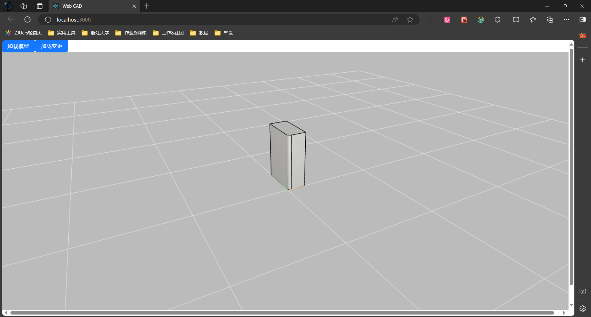

# 01.12~01.30

## 之前的进度

进行了理论的研究、BrCAD 格式的开发和渲染、BrCAD Diff 测试




后端仅直接生成长方体测试，尚未搭建真实数据流

```python
@api_view(['GET'])
def loadModel(request):
    # 新建一个长方体
    box = BRepPrimAPI_MakeBox(10., 20., 30.).Shape()
    # 创建一个倒角生成器,并设置倒角半径
    fillet = BRepFilletAPI_MakeFillet(box)
    edge_exp = TopExp_Explorer(box, TopAbs_EDGE, TopAbs_SHAPE)
    while edge_exp.More():
        edge = edge_exp.Current()
        fillet.Add(2.0, edge)
        break
    converter = TopoDSShapeConvertor(box)
    br_cad = converter.get_BrCAD()
    return ApiResponse(br_cad.to_dict())

@api_view(['GET'])
def loadDiff(request):
    # 新建一个长方体
    box = BRepPrimAPI_MakeBox(10., 20., 30.).Shape()
    # 创建一个倒角生成器,并设置倒角半径
    fillet = BRepFilletAPI_MakeFillet(box)
    edge_exp = TopExp_Explorer(box, TopAbs_EDGE, TopAbs_SHAPE)
    while edge_exp.More():
        edge = edge_exp.Current()
        fillet.Add(2.0, edge)
        break
    shape = fillet.Shape()
    converter_1 = TopoDSShapeConvertor(box)
    br_cad_1 = converter_1.get_BrCAD()
    converter_2 = TopoDSShapeConvertor(shape)
    br_cad_2 = converter_2.get_BrCAD()
    from BrCAD.BrCAD_compare import BrCADCompare
    br_cad_compare = BrCADCompare(br_cad_1, br_cad_2)
    return ApiResponse(br_cad_compare.get_diff())
```


## 完成的工作

- 前端 CAD 页面搭建
  - 页面组件（工具列表、CAD 展示区、操作台、历史记录、侧边栏（on Dev））
  - 模型操作对象（face/edge) 选中
  - 模型操作（Fillet）
  - History 漫游
- 后端核心改动
  - 模型序列化/反序列化高精度变更问题及解决
  - 搭建完整的模型数据流
    - 上传模型文件
    - 模型操作数据传递
    - 下载修改后的模型文件（STEP/STL)
- 多人协同
  - WebSocket 前后端消息传递、自动重连
  - 服务端推送


## 模型序列化/反序列化高精度变更问题及解决

之前一直发现生成的 BrCAD 大小比源文件还要大，现在将数据中超过 4 位小数的都 round 了，实测了一下，体积减小地很明显（比源文件略小），而且模型精度肉眼看起来未受影响。

测试了一下，模型数据确实改变了，但是不是 Pickle 的问题，而是序列化/反序列化之后，在计算一些数据时会发生高精度上的变更（比如小数点后十几位开始有些不同）。解决方法就是对 BrCAD 进行格式化，统一将数据的小数位数限定为 4。而之前只在 return 给前端的时候才做 round，没有影响到生成 id 的步骤，所以还是会存在高精度变更的问题。

最后的解决方案是在 calculate_hash 的时候统一对整个 face/edge 进行格式化（因为计算 hash 的时候，所有的数据一定已经写好了）。


## 数据库 Modal

```python
class Operation(models.Model):
    id = models.AutoField(primary_key=True)
    project_id = models.IntegerField()
    type = models.CharField(max_length=50)
    operator = models.CharField(max_length=50)
    time = models.IntegerField()
    data = models.TextField(null=True) # 前端请求传入的数据，用二进制序列化保存
    brcad = models.TextField()
    topods_shape = models.BinaryField()

class Project(models.Model):
    id = models.AutoField(primary_key=True)
    name = models.CharField(max_length=50)
    description = models.TextField()
    create_time = models.IntegerField()
    owner = models.CharField(max_length=50)
    operation_history_ids = models.TextField() # 用序列化 json 字符串保存操作历史记录的 id 数组
```


## Operation 后端统一接口

统一使用 post

request

```json
{
    lastOperationId: 0,
    projectId: 1,
    data: {
        choosedIdList: [], // 传入顺序与 pythonocc 参数顺序一致
        choosedTypeList: [],
    	props:{
    		example: "aha",
		}
    }
}
```

response

```
{
	code: 200,
	message: "",
	data: {
		operationId: 99,
		diff: brcadCompare,
		// 其余还未定
	}
}
```


## Operation 标准操作流程

```python
# Operation "Fillet"
@api_view(["POST"])
def fillet(request: HttpRequest):
    # step1: 获取参数
    params = json.loads(request.body)
    last_operation_id = params.get("lastOperationId")
    project_id = params.get("projectId")
    data = params.get("data")
    choosed_id_list = data.get("choosedIdList")
    choosedId = choosed_id_list[0]
    props = data.get("props")
    radius = props.get("radius")
    # step2: 获取上一步操作的 shape 和 id_TopoDS_Shape_map
    last_shape = pickle.loads(Operation.objects.get(id=last_operation_id).topods_shape)
    converter_1 = TopoDSShapeConvertor(last_shape)
    brcad_1 = converter_1.get_BrCAD()
    id_map = converter_1.get_id_TopoDS_Shape_map()
    # step3: 执行对应操作
    # 创建一个倒角生成器,并设置倒角半径
    fillet = BRepFilletAPI_MakeFillet(last_shape)
    fillet.Add(float(radius), id_map[choosedId])
    shape = fillet.Shape()
    # step4: 生成新的 BrCAD 对象进行比较
    converter_2 = TopoDSShapeConvertor(shape)
    brcad_2 = converter_2.get_BrCAD()
    brcad_compare = BrCADCompare(brcad_1, brcad_2)
    # step5: 保存操作
    operation = Operation(
        type="Fillet",
        project_id=1,
        operator="Br",
        time=int(time.time() * 1000),
        data=json.dumps(data),
        brcad=brcad_2.to_json(),
        topods_shape=pickle.dumps(shape),
    )
    operation.save()
    # step6: 更新 project 的 operation_history_ids
    project = Project.objects.get(id=1)
    operation_history_ids = json.loads(project.operation_history_ids)
    operation_history_ids.append(operation.id)
    project.operation_history_ids = json.dumps(operation_history_ids)
    project.save()
    # step7: 通知前端更新历史记录
    notify_update_history_list(project_id)

    return ApiResponse({"operationId": operation.id, "diff": brcad_compare.get_diff()})
```


## History 服务端推送

需求：在 HistoryList 更新之后由后端主动提醒前端更新。不能每次前端提交 Operation 的时候手动去拿 HistoryList，因为是多人项目，可能会有其他人提交 Operation，其他客户端必须被通知。

解决方案：WebSocket 服务端推送

WebSocket 由组件级单独维护。前端创建 HistoryList 组件的时候发送 Websocket 消息给后端，附带 projectId，后端将前端的 socketid 放入这个 project 的组，之后的后端推送消息都由组为单位。

每个 Socket 实例与页面的 HistoryList 互相独立，即每个页面的 Socket 都互相独立，确保单个用户在多个页面上同时操作多个 project 时也不会互相干扰。


## 接下来的工作

- 搭建整个用户系统

  - 用户登录注册，用户操作鉴权
  - 用户管理（用户信息修改等）
  - project 管理 （新建、编辑详细信息、删除、邀请协作者等）
  - 目前的 CAD 页面接入用户系统
    - 读取用户信息， operation、project 与用户挂钩
- CAD 本身

  - 添加更多的 Operation
    - Boolean 操作、标记（pin）等等
    - 对象多选
  - 装配体读取展示、高亮？
    - 需要对模型展示底层进行大幅度改动
    - 有技术上困难
  - 多人协同
    - 操作加锁，同时只能允许一人对模型进行操作
- 网站部署
  - 多人操作测试

- 整个多人聊天室系统


## 目前遇到的问题

- 毕设要求中的多人聊天室
  - 工作量巨大（工期预估一个月）、与主项目相关性弱
- 装配体
  - 资料少，代码迁移性弱