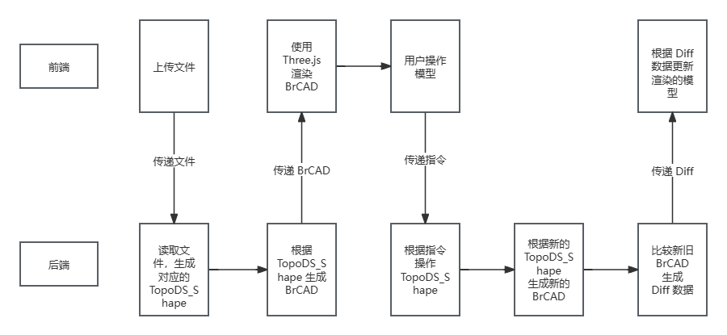

# 3.11 进度汇报

## 目前的工作

- 自定义前端渲染格式 BrCAD 设计
- Opencascade TopoDS_Shape 转 BrCAD
- BrCAD 增量式更新格式设计和实现
- 前端 CAD 页面
  - 页面组件（工具列表、CAD 展示区、操作台、历史记录、侧边栏（on Dev））
  - 模型操作对象（face/edge) 选中
  - 模型操作（Fillet）
  - History 漫游
- 后端
  - 搭建完整的模型数据流
    - 上传模型文件
    - 模型操作数据传递
    - 下载修改后的模型文件（STEP/STL)
- 多人协同
  - WebSocket 前后端消息传递、自动重连
  - 服务端推送


## 功能

### CAD页面整体示意图

鼠标滑过黄色高亮，左键单机红色选中


### 模型功能

导入


模型导出


Fillet


### 基于单序列历史记录的多人协同

Delete


Transfer


History Checking 模式（由 Transfer 或者他人进行了 CAD 操作引起，本质上是当前页面未处于最新 operation），除“导出”外的模型操作功能均被禁用


Rollback


Rollback concatenation Mode


Rollback with no concatenation Mode


## 前后端

几个概念：

- BrCAD：用来前端渲染模型的格式
- Diff：用来增量式更新 BrCAD 的格式
- TopoDS_Shape：OpenCascade 读取文件之后，在内存中，模型数据的格式
- Three.js：前端的 3D 渲染引擎



前端负责：

- 展示模型、操作模型
- 根据 Diff 更新模型

后端负责：

- 操作 OpenCascade 对模型进行变更
- 根据 TopoDS_Shape 生成 BrCAD
- BrCAD Diff

## BrCAD

### 格式

模型结构树 + 模型具体数据，具体格式如下：

```json
{
    "structure": {
        "label": "root",
        "faces": [对应的 face id 数组], // 如果不是底层结构，则这个数组将会为空
        "edges": [对应的 edge id 数组], // 如果不是底层结构，则这个数组将会为空
        "children": [
            {
                "label": "root",
                "faces": [对应的 face id 数组],
                "edges": [对应的 edge id 数组],
                "children": [] // 省略
            },
		]
    },
    "faces": [
            {
                "id": "生成的 MD5 字符串",
                "vertexCoordinates": self.vertex_coordinates,
                "uvCoordinates": self.uv_coordinates,
                "normalCoordinates": self.normal_coordinates,
                "triangleIndexes": self.triangle_indexes,
                "numberOfTriangles": self.number_of_triangles,
            },
        	// 其他 face 略
    ],
    "edges": [
            {
                "id": "生成的 MD5 字符串",
                "vertexCoordinates": self.vertex_coordinates,
            },
        	// 其他 edge 略
    ],
}
```

为什么将 structure 和 具体数据分开：

- 平时渲染不需要 structure
- 方便进行 diff 和增量式更新，直接更新拓扑结构内部数据，而不用被外层的 structure 限制

face/edge 的 id 使用模型数据生成，保证唯一性，且可以被二次生成并一一对应（增量式更新的基础）：

```python
def calculate_hash(self):
        attributes = []

        attributes.extend(self.vertex_coordinates)
        attributes.extend(self.uv_coordinates)
        attributes.extend(self.normal_coordinates)
        attributes.extend(self.triangle_indexes)
        attributes.append(self.number_of_triangles)

        attributes_str = [str(attr) for attr in attributes]
        hash_str = ''.join(attributes_str)

        result = hashlib.md5(hash_str.encode())
        self.id = result.hexdigest()
```

### TopoDS_Shape 转 BrCAD

参考 [WebCad: 在Web中实现CAD的功能 (gitee.com)](https://gitee.com/CWBOY/web-cad)

具体即使用 OpenCascade 的各种内置 api 读取并 format TopoDS_Shape to BrCAD


### Three.js 渲染

参考 [WebCad: 在Web中实现CAD的功能 (gitee.com)](https://gitee.com/CWBOY/web-cad)

具体为将 BrCAD 内的数据格式化之后使用 Three.js 渲染


### 增量式更新

#### Diff 的数据变更唯一标识符—— ID

虽然我们将 TopoDS_Shape 转成 mesh，但是这个 mesh 的基本元素 face/edge 依然是和 TopoDS_FACE/Edge 一一对应的，而且这种对应关系将会保持：因为我们在 mesh 中的 face 的 id 是 TopoDS_FACE 的数据生成的 MD5，这意味着如果这个 face 的基本数据如果没有因为 Opencascade 操作而改变的话，当我们在结束 opencascade 操作之后重新将 TopoDS_SHAPE 转化成我们的前端格式时，没有波及到的 face 的 id 都没有改变，而这就是我们做增量式更新最重要的 diff 。

即，只要 id 还在，说明这个拓扑结构没有发生变化。新的 id 代表新的拓扑结构生成了，原先的 id 不存在了代表老的拓扑结构被删除了。不存在拓扑结构被修改了这一情况，因为OpenCascade 只会告诉我们，这里有一个面，这个面的数据，至于这个面是由之前哪个面转化而来的，OpenCascade 不关心。

#### 增量式更新的格式

增量式更新分为如下几个部分：

- structure：采用类似 React v15 版本的树形递归策略进行 diff 和 apply
- delete: 根据要删除的几何结构的 id 来直接在前端数据中删除
- add：直接将传输过来的新增至前端数据库 

```json
{
    "structure": {
        "label": "root",
        "status": "children_changed", // status 有 "unchanged"/"children_changed"/"changed"
        "faces": [],
        "edges": [],
        "children": [
            {
                "label": "part_1",
                "status": "unchanged", // 递归结束
                "faces": [],
        		"edges": [],
                "children": [], // 因为 changed = false, 递归结束，所以直接是空的
            },
            {
                "label": "part_2",
                "status": "changed", // 如果 status 是 changed，就直接整个替换，包括 children
                "faces": [111,222,333,444],
        		"edges": [1,2,3,4,5,6,7,8,9,10],
                "children": [], // changed 节点的 children 将会满足
            }
        ],
    },
    "delete": {
        "face_ids": [face id 数组],
        "edge_ids": [edge id 数组],
    },
    "add": {
        "faces": [新增的 face 的数组，格式跟 BrCAD 中一致],
        "edges": [新增的 edge 的数组，格式跟 BrCAD 中一致],
    }
}
```

为什么不在原来的 face/edge 上修改数据

- 更改后的 TopoDS_Shape 的 face 和 edge 和更改前的完全没有对应关系（核心）
- face/edge 本身的单个数据量不大，直接 add 的负担较轻

## History 服务端推送

需求：在 HistoryList 更新之后由后端主动提醒前端更新。不能每次前端提交 Operation 的时候手动去拿 HistoryList，因为是多人项目，可能会有其他人提交 Operation，其他客户端必须被通知。

解决方案：WebSocket 服务端推送

WebSocket 由组件级单独维护。前端创建 HistoryList 组件的时候发送 Websocket 消息给后端，附带 projectId，后端将前端的 socketid 放入这个 project 的组，之后的后端推送消息都由组为单位。

每个 Socket 实例与页面的 HistoryList 互相独立，即每个页面的 Socket 都互相独立，确保单个用户在多个页面上同时操作多个 project 时也不会互相干扰。


## 接下来的工作

- 搭建整个用户系统

  - 用户登录注册，用户操作鉴权
  - 用户管理（用户信息修改等）
  - project 管理 （新建、编辑详细信息、删除、邀请协作者等）
  - 目前的 CAD 页面接入用户系统
    - 读取用户信息， operation、project 与用户挂钩
- CAD 本身

  - 添加更多的 Operation
    - Boolean 操作、标记（pin）等等
    - 对象多选
  - 模型 NodeTree 展示，Solid 高亮
    - 需要对模型展示底层进行大幅度改动
  - 多人协同
    - 操作加锁，同时只能允许一人对模型进行操作
- 网站部署
  - 多人操作测试

